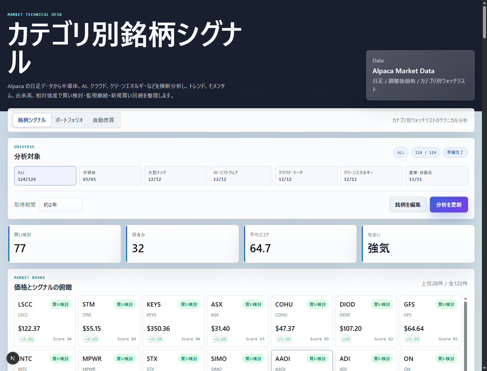
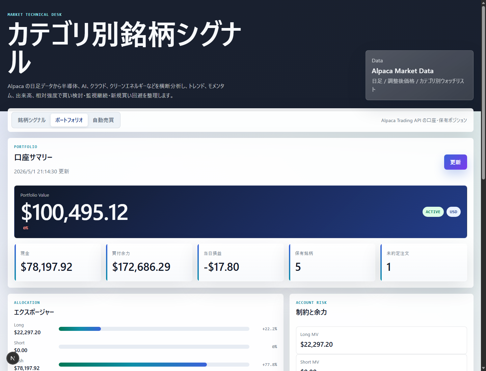
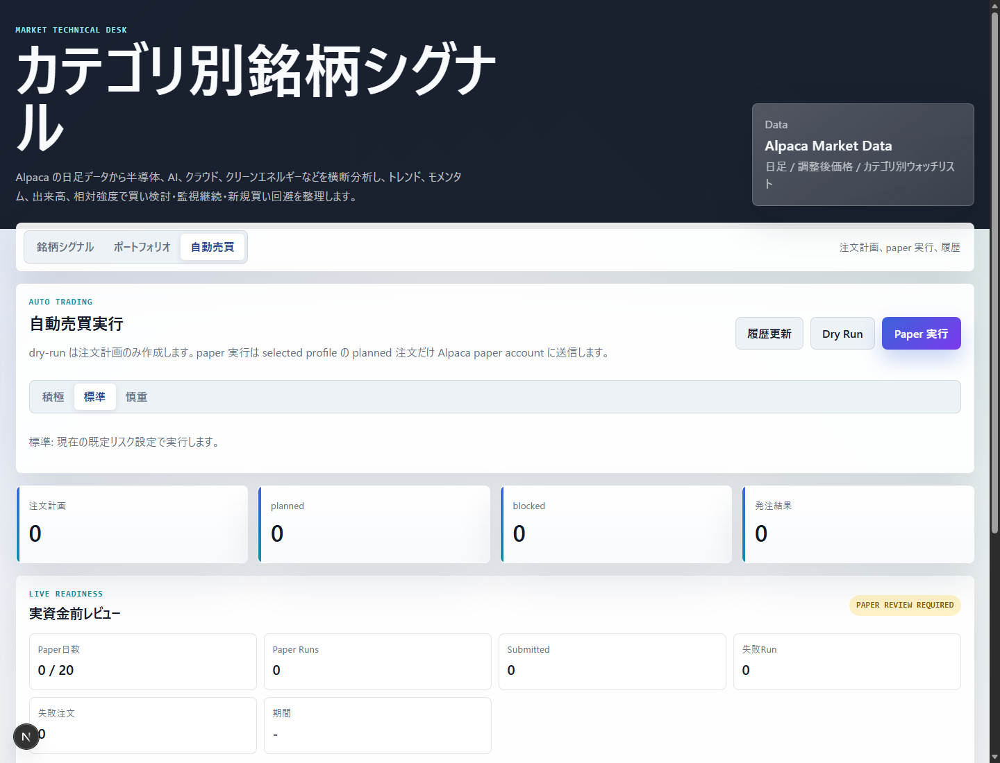
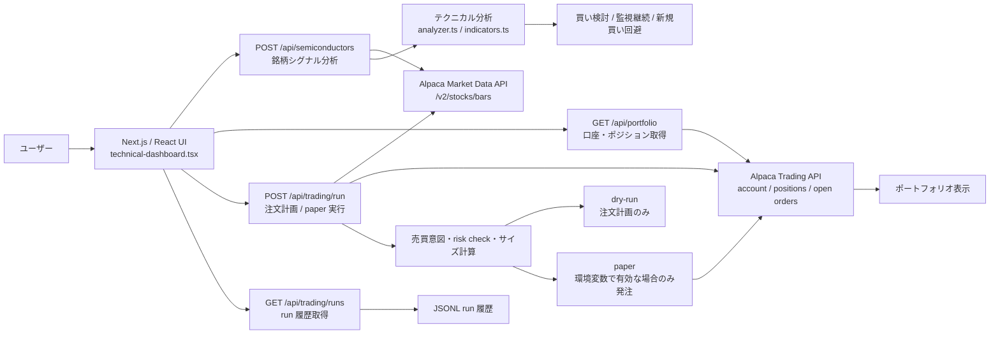
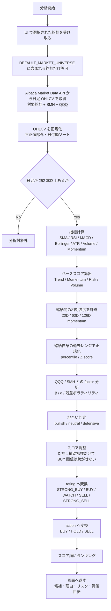
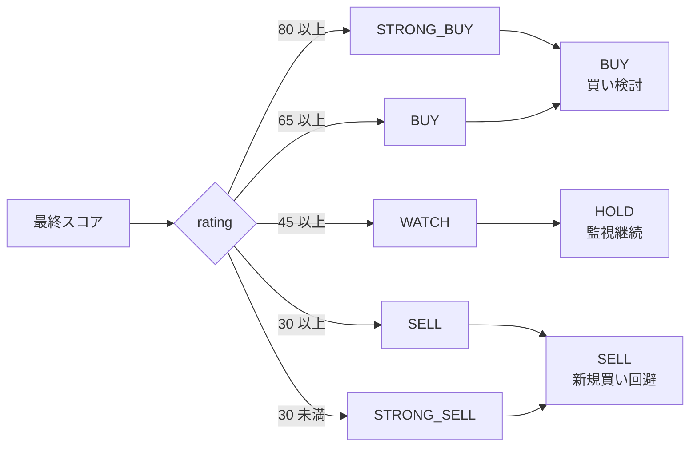
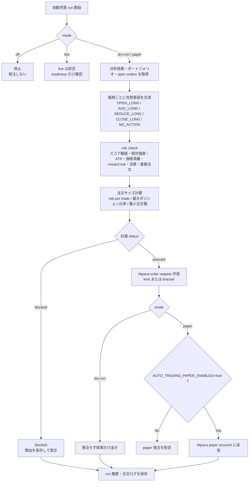

# Alpaca API と Next.js で、半導体・AI 関連銘柄のテクニカル分析アプリを作った

## Alpaca API と Next.js で、半導体・AI 関連銘柄のテクニカル分析アプリを作った

投資判断をするとき、毎回チャートを開いて、移動平均線を見て、RSI や MACD を確認して、出来高も見て、ついでに保有ポジションも確認する、という作業が地味に面倒だった。

特に自分が継続して見たいのは、半導体や AI 関連の銘柄だった。NVDA、AMD、AVGO、ASML のような半導体寄りの銘柄だけでなく、MSFT、GOOGL、PLTR、SNOW、CRWD、ANET、TSLA など、AI やクラウド、周辺インフラまで含めると見る対象がかなり多い。

ただ、最終的な投資判断をアプリに任せたいわけではなかった。むしろ「今どの銘柄を優先して見るべきか」「買いを検討してよさそうな状態なのか」「今は見送ったほうがよさそうなのか」を整理するための道具が欲しかった。

そこで、Alpaca API から株価データと口座情報を取得し、カテゴリ別の銘柄を横断してテクニカル分析できる Web アプリを作った。

## 作ったもの

作ったアプリは、カテゴリ別ウォッチリストを対象にしたテクニカル分析ダッシュボード。

画面は大きく 3 つのタブに分かれている。

### 銘柄シグナル

メインの画面。Alpaca Market Data API から日足の OHLCV を取得し、各銘柄を `買い検討`、`監視継続`、`新規買い回避` に分類する。

この画面では、最初にウォッチリスト全体の状態をざっくり見る。ALL とカテゴリ別の切り替え、取得期間、分析更新ボタンを上に置き、その下に買い検討数、弱含み数、平均スコア、地合いを並べた。

その下の Market Board は、スコア上位の銘柄をカードで見られる部分。銘柄コード、現在値、当日変化率、スコア、買い検討ラベルをまとめて表示している。細かい指標を見る前に、まず「今どの銘柄が強く出ているか」を掴むための入口にした。

分析対象はコード上では以下のカテゴリに分けている。

- 半導体
- 大型テック
- AI・ソフトウェア
- クラウド・データ
- クリーンエネルギー
- 産業・自動化

デフォルトのウォッチリストは `lib/semiconductors/types.ts` に定義していて、半導体カテゴリだけでも NVDA、AMD、AVGO、ASML、TSM、AMAT、LRCX、KLAC、MU などを含めている。アプリ上では ALL 表示とカテゴリ別表示を切り替えられるようにした。

画面では、買い検討候補の数、弱含み候補の数、平均スコア、地合いをざっくり見られる。銘柄ごとのカード、ランキングテーブル、詳細パネルも用意した。詳細では、ローソク足に近い価格チャート、スコア内訳、正規化したテクニカル指標、理想買値、押し目、損切り目安、利確目安、買い材料、リスクを表示している。

### ポートフォリオ

Alpaca Trading API から口座情報と保有ポジションを取得するタブ。

ポートフォリオ画面では、口座評価額、現金、買付余力、当日損益、保有銘柄数、未約定注文数を上部にまとめている。テクニカルシグナルだけを見ると「買い候補」ばかりに目が行きやすいので、実際の余力や保有比率も同じアプリ内で見られるようにした。

下部では Long / Short / Cash のエクスポージャーや、アカウントの制約、未約定注文、保有ポジションを確認できる。ここは投資判断の画面というより、シグナルを見る前後に口座の状態を確認するための画面に近い。

取得しているのは `/v2/account`、`/v2/positions`、`/v2/orders?status=open&nested=false`。表示内容は、口座評価額、現金、買付余力、当日損益、Long / Short / Cash のエクスポージャー、保有ポジション、含み損益、未約定注文など。

単にシグナルを見るだけだと、実際の保有状況と切り離されてしまう。ポートフォリオ表示を入れたのは、「良さそうな銘柄」だけでなく「今の自分の口座でどう見えるか」も同じ画面の流れで確認したかったから。

### 自動売買

自動売買タブもある。ただし、現状の位置づけはかなり慎重にしている。

自動売買画面では、Dry Run と Paper 実行を分けている。リスク姿勢も `積極`、`標準`、`慎重` の 3 つに分け、同じ分析結果でもどれくらい厳しく注文計画を作るかを変えられるようにした。

画面下には、注文計画、planned、blocked、発注結果、paper run の readiness を表示している。スクリーンショットの状態では、まだ実行結果がないため 0 件が並んでいる。ここは「自動で買う画面」というより、注文計画を作り、どの条件で止まったかを確認するためのレビュー画面として作っている。

実装としては dry-run と paper 実行に対応している。dry-run は注文計画だけを作り、Alpaca には発注しない。paper 実行は `AUTO_TRADING_PAPER_ENABLED=true` が設定されている場合だけ、Alpaca の paper account に planned 注文を送る。

live mode の分岐もコード上にはあるが、現時点では live 発注は拒否する実装になっている。`AUTO_TRADING_KILL_SWITCH`、live URL への送信拒否、open orders の再取得による重複発注防止、run 履歴の保存など、安全側の仕組みを多めに入れている。

ここは「完全自動売買システムを作った」というより、将来的に自動化を検証するための土台という扱いに近い。

## 技術構成

フロントエンドと API は Next.js でまとめている。依存関係を見ると、主要な構成は次の通り。

- Next.js 15
- React 19
- TypeScript
- Vitest
- Alpaca Market Data API
- Alpaca Trading API

UI は `components/technical-dashboard.tsx` にまとまっていて、Next.js の App Router 配下に API Route を置いている。

全体の構成をざっくり図にすると、こうなる。

画面は React で状態を持ち、データ取得や API キーが必要な処理は API Route 側に寄せている。Alpaca の API キーをブラウザに出さないためでもあるし、分析ロジックをサーバー側の TypeScript に閉じ込めたかったという理由もある。

主な API Route は以下。

- `POST /api/semiconductors`
- `GET /api/portfolio`
- `POST /api/trading/run`
- `GET /api/trading/runs`

`/api/semiconductors` という名前は残っているが、実際には半導体だけではなく、カテゴリ別ユニバース全体を扱っている。ここは過去の名残が残っている部分だと思う。

Alpaca API は用途を分けて使っている。

Market Data API は日足データの取得に使う。`/v2/stocks/bars` から複数銘柄の 1Day バーを取得し、`adjustment=all`、`feed=iex` を指定している。取得期間は UI から約 1 年、約 2 年、約 3 年を選べるが、API 側では `lookbackDays` を 260 から 900 の範囲に丸めている。

Trading API は口座・ポジション・注文関連に使う。ポートフォリオ画面では account、positions、open orders を取得し、自動売買では paper 注文の送信にも使う。

API キーは環境変数から読む。`APCA_API_KEY_ID` と `APCA_API_SECRET_KEY` が基本で、`ALPACA_API_KEY`、`ALPACA_API_SECRET` などの別名にも対応している。Trading API の接続先は `ALPACA_TRADING_BASE_URL` で切り替える。`.env.example` では paper の URL が指定されている。

## テクニカル分析ロジック

分析ロジックは `lib/semiconductors/analyzer.ts` と `lib/semiconductors/indicators.ts` が中心。

まず前提として、200 日移動平均線を使うため、日足が 252 本未満の銘柄は分析対象から外すようにしている。短い履歴で無理に判定しないための制約。

分析処理の流れは、だいたい次のようになっている。

使っている主な指標は以下。

- 20 日、50 日、200 日の単純移動平均
- RSI 14
- MACD
- ボリンジャーバンド
- ATR 14
- 出来高の 1 日 / 20 日比率
- 出来高の 5 日 / 20 日比率
- 20、63、126 営業日のモメンタム
- 126 営業日高値からのドローダウン
- 銘柄自身の過去レンジに対するパーセンタイルや Z スコア
- QQQ と SMH を proxy にした CAPM 風の β、α、残差ボラティリティ

最初は、移動平均線や RSI だけを見ればある程度分類できると思っていた。ただ、実際には半導体や AI 関連は値動きが荒く、単純な条件だけだと極端な判定になりやすい。

そこで、最終的にはスコアリング方式にした。

ベーススコアは次の 5 つで構成している。

- トレンド
- モメンタム
- 相対強度
- リスク
- 出来高

重みは、トレンド 30%、モメンタム 25%、相対強度 20%、リスク 15%、出来高 10%。このベーススコアに、銘柄自身の過去レンジと、QQQ / SMH に対するファクター分析の結果を小さく加減点している。

ただし、調整だけで BUY 閾値をまたがないようにしている。コード上でも、ベーススコアが BUY 未満なのに調整後だけで BUY に届いた場合は、BUY の直前で止めるようにしている。この設計はわりと大事だった。補助指標で雰囲気だけ良く見せるのではなく、主要なテクニカル条件がある程度そろっている銘柄だけを買い検討にしたかった。

判定はスコアから rating に変換し、さらに action に落としている。

- `STRONG_BUY` / `BUY` は `BUY`
- `WATCH` は `HOLD`
- `SELL` / `STRONG_SELL` は `SELL`

UI 上ではこれを `買い検討`、`監視継続`、`新規買い回避` として見せている。

この変換だけを抜き出すと、かなり単純に見える。

ただ、実際にはこの前段に、地合いフィルタや決算前フィルタ、銘柄自身の過去レンジに対する調整がある。特に defensive な地合いでは BUY にかなりブレーキをかけるようにしている。

地合いも判定に入れている。SMH と QQQ の 50 日線、QQQ の 200 日線を見て、bullish、neutral、defensive に分類する。defensive のときは買い判定をかなり抑え、neutral のときも追加のスコアバッファを要求する。

このあたりは少し保守的にしすぎた可能性がある。すべての条件を満たさないと買いにならない設計にすると、シグナルがほとんど出ない。特に自動売買側では、BUY 判定に加えて、相対強度上位、ATR、価格の伸びすぎ、reward:risk、決算ブラックアウト、ポートフォリオ上限なども見るので、かなりブロックされやすい。

これは悪いことばかりではないが、「買いかどうか」を二値で出すより、「どの条件で落ちたのか」「あと何が改善すれば候補になるのか」を見せるほうが、このアプリの目的には合っていると感じた。

## 実装して難しかったところ

一番悩んだのは、投資判断をどこまで自動化するかだった。

テクニカル指標を計算してスコアを出すところまでは、比較的 Web アプリらしい実装に落とせる。ただ、そこから先の「買う」「売る」に近づくほど、判断の重さが変わる。

たとえば `BUY` と表示すると、どうしても「買うべき」という印象が強くなる。でもコード上の `BUY` は、あくまで条件を満たした「買い検討」だ。企業決算、ニュース、ガイダンス、金利、需給、流動性、自分のポジションサイズまでは見ていない。

そのため、UI では投資助言ではないことを明示しつつ、買い材料とリスクを並べて表示するようにした。損切り目安や利確目安も出しているが、これも注文指示ではなく、判断材料としての表示にしている。

外部 API のレスポンス処理も地味に気を使った。Alpaca の数値は文字列で返るものもあるので、ポートフォリオ側では `toNumber` や `toNullableNumber` で正規化している。Market Data 側も、OHLCV が数値として扱えるものだけを残し、日付順にソートしてから分析する。

API キーの扱いも注意した。クライアント側から直接 Alpaca を叩かず、Next.js の API Route で環境変数を読む形にしている。`.env.example` にはキー名だけを置き、実際のキーは `.env.local` などに置く想定。

自動売買まわりは、むしろ「動かすこと」より「勝手に動かないこと」を重視した。既定 mode は `off`、API の未指定実行は dry-run、paper 発注は環境変数で明示的に有効化しないと動かない。live URL への注文送信は `allowLive: true` がないと拒否し、API Route 側でも live 発注は現時点で止めている。

自動売買側の流れは、テクニカル分析の `BUY` をそのまま注文に変換するものではない。もう一段、売買意図とリスクチェックを挟んでいる。

この図の通り、`BUY` シグナルが出ても、すぐに注文にはならない。たとえばスコアが閾値未満、相対強度が上位グループ外、ATR が高すぎる、20 日線から伸びすぎている、既に open order がある、といった場合は `blocked` になる。

## 使ってみて感じた課題

今の実装は、監視支援ツールとしては形になってきた一方で、まだ改善したい点も多い。

まず、判定条件はかなり厳しい。テクニカルスコアで BUY になっても、自動売買側ではさらに複数の risk check がかかる。結果として、注文計画が `blocked` になりやすい。

これは安全側ではあるが、実運用で見るなら「なぜ blocked なのか」をもっと分かりやすくしたい。現状でもブロック理由は持っているが、UI 上ではまだ改善余地がある。たとえば「スコアは足りているが、価格が 20 日線から伸びすぎ」「ATR が高すぎる」「相対強度の上位グループに入っていない」のように、次の行動に結びつく見せ方にしたい。

バックテストの必要性も感じている。`lib/semiconductors/backtest.ts` には、過去時点のシグナルに対して 20 / 63 営業日後のリターン、勝率、中央値リターン、profit factor、最大逆行、最大ドローダウンなどを集計する実装がある。ただ、これを UI で見られるところまでは作り込めていない。

スコアの閾値も、まだ仮説に近い。半導体とクリーンエネルギーでは値動きのクセが違うし、大型テックと小型のソフトウェア銘柄でもボラティリティが違う。今は同じロジックで横断的に見ているが、カテゴリごとの調整や、銘柄ごとの特性をもう少し入れたほうが自然かもしれない。

また、決算日やニュースの扱いも課題。コード上には `earningsDate` を扱うフィールドや決算前のフィルタがあるが、デフォルトの銘柄定義には決算日データが入っていない。ニュースも取得していない。テクニカルだけで判断するには限界があるので、ここは今後足したい。

## 今後やりたいこと

まずやりたいのは、シグナルを `buy / sell` の二値ではなく、より説明可能なスコアとして見せること。

今も内部的にはスコアを持っているが、UI としてはまだ「買い検討」「監視」「回避」の印象が強い。実際には、65 点の BUY と 82 点の STRONG_BUY では意味が違うし、64 点の WATCH は BUY とほとんど境界にいる。境界付近の銘柄をどう扱うかは、もっと丁寧に見せたい。

次に、バックテスト結果をアプリ上で見られるようにしたい。スコア帯ごとの将来リターンや、BUY 判定の勝率、最大逆行を見られれば、閾値調整の根拠が作りやすくなる。

ほかには、次のような改善を考えている。

- 銘柄ごとの判定理由をさらに詳しく表示する
- blocked 理由を UI 上で分かりやすく分類する
- 決算日やニュースを組み込む
- カテゴリごとの相対比較を強化する
- 保有銘柄に対するアラートを出す
- バックテスト結果から閾値を調整できるようにする
- note や Markdown に出力できるレポート機能を追加する

特にレポート機能は、このアプリと相性がよさそうだと思っている。毎日または毎週、ウォッチリストの上位銘柄、スコア変化、買い材料、リスク、保有ポジションの変化を Markdown で吐き出せれば、そのまま投資メモとして残せる。

## まとめ

このアプリは、まだ投資判断を任せられるものではない。

テクニカル指標は計算できるし、カテゴリ別に銘柄を並べられるし、Alpaca の口座情報ともつながっている。dry-run や paper 実行の土台もある。ただ、それでも最終判断には決算、ニュース、相場全体、自分の資金管理が必要になる。

一方で、自分の判断材料を整理するツールとしては、だいぶ形になってきた。少なくとも、毎回チャートを開いて同じ指標を手で確認する作業は減らせる。

個人開発として作ってみて感じたのは、投資アプリは「便利にするほど危うくなる」面があるということだった。自動化したくなるが、自動化しすぎると判断の責任が見えにくくなる。だから今は、売買判断を代行するアプリではなく、自分が見るべき情報を整理するアプリとして育てていくのがよさそうだと考えている。