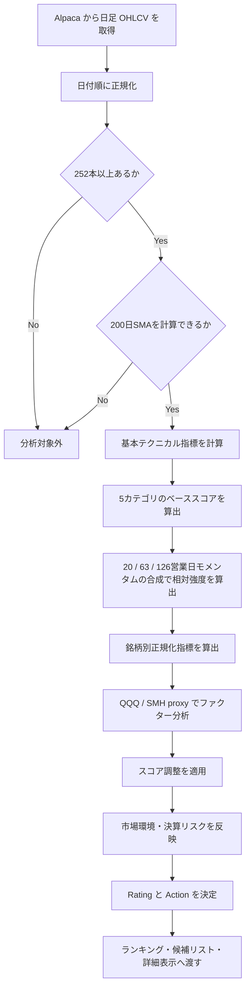
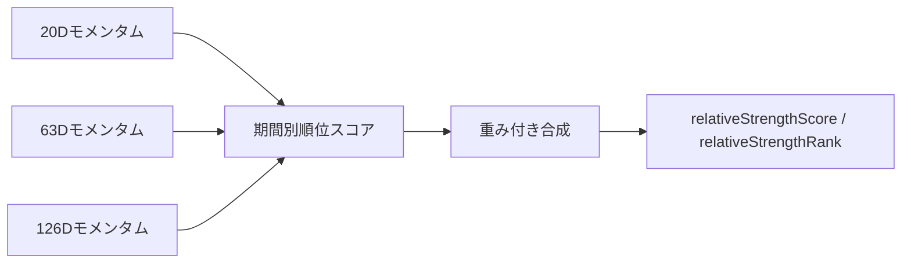

# カテゴリ別銘柄テクニカル分析ロジック

このドキュメントは、半導体、大型テック、AI・ソフトウェア、クラウド・データ、クリーンエネルギー、産業・自動化などのカテゴリ別ウォッチリストを `BUY` / `HOLD` / `SELL` に分類する分析ロジックを説明します。UI では断定的な表現を避け、`BUY` は「買い検討」、`HOLD` は「監視継続」、`SELL` は「新規買い回避」と表示します。

現行ロジックは、従来の価格・出来高テクニカルに加えて、銘柄自身の履歴に対する正規化、QQQ / SMH を proxy にした CAPM 風ファクター分析、バックテスト用の検証基盤を持ちます。UI では `ALL` とカテゴリ別の表示を切り替えられますが、分析 API には選択された銘柄ユニバース全体を渡し、その結果をカテゴリで絞り込んで表示します。

実装の中心は次のファイルです。

- `lib/semiconductors/analyzer.ts`
- `lib/semiconductors/indicators.ts`
- `lib/semiconductors/normalization.ts`
- `lib/semiconductors/factors.ts`
- `lib/semiconductors/backtest.ts`
- `lib/semiconductors/types.ts`

`types.ts` では `SECURITY_CATEGORIES` と `DEFAULT_MARKET_UNIVERSE` が定義されています。カテゴリを追加する場合は、カテゴリ定義と銘柄リストを追加すれば、API の allowlist、UI のカテゴリタブ、分析対象が同じ定義から更新されます。後方互換用に `DEFAULT_SEMICONDUCTOR_UNIVERSE` は残しています。

## 全体フロー



## データ本数と200日線

200日移動平均線をスコアに使うため、分析に必要な最低日足本数は `252本` です。

252本未満、または200日SMAが計算できない銘柄は、長期トレンドを誤って減点しないため分析対象から除外します。さらに、同一分析 run では最新の `asOf` 日付に揃わない stale な銘柄もランキング対象から外します。除外銘柄は `summary.excludedSymbols` に入ります。

## 使用指標

| 指標 | 用途 |
| --- | --- |
| 20日SMA | 短期トレンド |
| 50日SMA | 中期トレンド |
| 200日SMA | 長期トレンド |
| 20 / 63 / 126営業日モメンタム | 短期・中期・長期の勢い |
| RSI 14 | 過熱感・弱さの補助確認。価格が横ばいで平均上昇幅・平均下落幅がともに0の場合は中立の50 |
| MACD 12/26/9 | モメンタムの方向と拡大・縮小 |
| ATR 14 | 値幅リスク |
| 出来高比率 | 直近出来高と20日平均出来高の比較 |
| 直近126営業日高値からの下落率 | 高値からの崩れ具合 |
| 銘柄別パーセンタイル | 銘柄自身の過去レンジに対する現在位置 |
| 銘柄別 Z スコア | 価格位置の伸びすぎ確認 |
| CAPM 風 β / α | QQQ / SMH への感応度と市場調整後の強さ |
| 残差ボラティリティ | 市場・セクターで説明できない値動きリスク |

## ベーススコア

最初に、5つのカテゴリをそれぞれ `0-100` 点に正規化し、重み付き平均でベーススコアを計算します。

```text
baseScore =
  trendScore * 0.30
+ momentumScore * 0.25
+ relativeStrengthScore * 0.20
+ riskScore * 0.15
+ volumeScore * 0.10
```

各銘柄には次の内訳が返ります。

```ts
scoreBreakdown: {
  trendScore: number;
  momentumScore: number;
  relativeStrengthScore: number;
  riskScore: number;
  volumeScore: number;
}
```

### trendScore

終値が20日線・50日線・200日線を上回っているか、50日線が200日線を上回っているかを見ます。さらに、終値と各SMAの乖離率も軽く反映します。

移動平均系の情報は似た意味を持つため、過剰な重複加点にならないよう、トレンドカテゴリ内でまとめて評価します。

### momentumScore

20 / 63 / 126営業日モメンタムと MACD Histogram で計算します。

20日と63日のモメンタムは相関が高いため、それぞれを独立に大きく加点するのではなく、カテゴリ内で重みを分けています。MACD Histogram は符号だけでなく、前回値より拡大しているかも見ます。

### relativeStrengthScore

分析対象銘柄内で、20 / 63 / 126営業日モメンタムをそれぞれ順位付けし、各期間の順位スコアを合成します。単一期間の急騰だけでセクター内リーダーと判定しないよう、短期・中期・長期を次の重みで評価します。

```text
relativeStrengthScore =
  20D relative momentum rank score  * 0.25
+ 63D relative momentum rank score  * 0.45
+126D relative momentum rank score  * 0.30
```

各期間の順位スコアは、最上位を100点、最下位を0点として線形変換します。`relativeStrengthRank` はこの合成スコアで順位付けします。



このカテゴリにより、単独で強いだけでなく、分析対象ユニバース内で相対的に資金が向かっている銘柄を評価できます。UI をカテゴリ表示に切り替えた場合、表示上のランキングや候補リストはそのカテゴリだけに絞られますが、分析時の相対強度はリクエストされたユニバースを母集団にして計算されます。63日だけが強く、20日または126日が伴わない銘柄は、持続性確認が不足しているものとして合成スコアが抑えられます。

### riskScore

リスクスコアは、高いほど低リスクです。

主に次を見ます。

- ATR比率: `ATR14 / 終値`
- 直近126営業日高値からの下落率

ATR比率が高い銘柄、または高値から大きく崩れている銘柄は減点されます。

### volumeScore

出来高スコアは、当日出来高だけでなく、直近5日平均出来高も見ます。

| 指標 | 計算 |
| --- | --- |
| 当日出来高比率 | `最新出来高 / 20日平均出来高` |
| 5日出来高比率 | `5日平均出来高 / 20日平均出来高` |

出来高増を伴う上昇は加点し、出来高増を伴う下落は減点します。

## 銘柄別正規化

固定閾値だけでは、NVDA、TSM、ASML、INTC のように通常ボラティリティが異なる銘柄を同じ尺度で評価してしまいます。そのため `normalization.ts` で、各銘柄自身の履歴に対する相対位置を計算します。

主な出力は次の通りです。

```ts
normalizedTechnicals: {
  closePercentileRank: number | null;
  closeZScore: number | null;
  atrPctPercentile: number | null;
  momentum20Percentile: number | null;
  momentum63Percentile: number | null;
  momentum126Percentile: number | null;
}
```

評価の考え方:

- 63日モメンタムが銘柄自身の過去レンジ上位なら小さく加点
- 126日モメンタムが過去レンジ上位なら小さく加点
- ATR が銘柄自身の過去レンジで極端に高い場合は減点
- 価格 Z スコアが高すぎる場合は、短期的な伸びすぎとして減点

これらは `scoreAdjustments` として返ります。

```ts
scoreAdjustments: Array<{
  source: "normalization" | "factor" | "market-regime" | "earnings" | "signal-stability";
  label: string;
  value: number;
}>
```

重要な制約として、正規化・ファクター調整だけで `BUY` 閾値をまたがせないようにしています。ベーススコアが `BUY` 未満の銘柄は、調整後も `BUY` 閾値直下に留めます。これは補助指標だけで新規買い判定が発生することを避けるためです。

## CAPM / ファクター分析

`factors.ts` は、CAPM やマルチファクター分析に使う純粋関数を提供します。

主な関数:

- `calculateReturns`
- `calculateExcessReturns`
- `calculateBetaFromReturns`
- `calculateCapmExposure`
- `calculateMultiFactorExposure`
- `buildFactorScore`

分析本体では、現在は外部ファクターデータを取得せず、取得済みの日足だけを使います。

| Proxy | 用途 |
| --- | --- |
| QQQ | 市場・大型グロース proxy |
| SMH | 半導体セクター、およびグロース・AI 関連リスクの補助 proxy |

`analyzer.ts` では、銘柄リターンを QQQ / SMH のリターンと日付で突き合わせ、β、年率換算 α、残差ボラティリティ、factorScore を計算します。半導体以外のカテゴリでも同じ proxy を使うため、SMH への感応度は「半導体要因そのもの」ではなく、AI・設備投資・高ベータグロースに近い値動きの補助指標として解釈します。

```ts
factorAnalysis: {
  marketBeta: number | null;
  sectorBeta: number | null;
  alpha: number | null;
  residualVolatility: number | null;
  factorScore: number | null;
  observations: number;
}
```

factorScore が高い場合は、市場・セクターを考慮しても強い銘柄として小さく加点します。factorScore が低い場合、または高βかつ残差ボラティリティが高い場合は小さく減点します。

このファクター分析は、本格的な Fama-French や APT の代替ではありません。現時点では、テクニカル判定に「市場・セクター要因で説明できる強さか、銘柄固有の強さか」を補助的に加えるための軽量な proxy です。

## Rating と Action

調整後の Final Score から Rating を決め、Rating から内部 Action を決めます。

| Final Score | Rating | 内部Action | UI表示 |
| ---: | --- | --- | --- |
| 80以上 | `STRONG_BUY` | `BUY` | 買い検討 |
| 65以上80未満 | `BUY` | `BUY` | 買い検討 |
| 45以上65未満 | `WATCH` | `HOLD` | 監視継続 |
| 30以上45未満 | `SELL` | `SELL` | 新規買い回避 |
| 30未満 | `STRONG_SELL` | `SELL` | 新規買い回避 |

## 市場環境フィルター

SMH と QQQ の日足を同時に取得し、簡易的な市場環境を計算します。

| 条件 | marketRegime |
| --- | --- |
| SMH と QQQ がともに50日線より上 | `bullish` |
| どちらかが50日線を下回る | `neutral` |
| 両方が50日線を下回る、または QQQ が200日線を下回る | `defensive` |

市場環境は、単純なラベルではなくエントリー閾値にも反映します。

| marketRegime | Score調整 | BUYに必要な調整後スコア |
| --- | ---: | ---: |
| `bullish` | 0 | 65 |
| `neutral` | -3 | 68 |
| `defensive` | -10 | 80 |

`neutral` と `defensive` では `scoreAdjustments` に市場環境由来の調整を残します。調整後スコアが通常のBUY閾値 `65` 以上でも、上表の市場環境別BUY閾値に届かない場合は `64` に抑え、`WATCH` / `HOLD` に留めます。これにより、守り寄りの相場で弱いBUYが発生しにくくなります。

## 損切り・利確目安

損切り目安は、防衛的な損失限定ラインとして計算します。

```text
stopLoss = max(currentPrice - ATR * 2.2, validBelowCurrent(sma50 * 0.96))
```

50日SMAがない場合は `currentPrice - ATR * 2.2` を使います。ATRがない場合は `currentPrice * 0.04` を代替ATRとして使います。急落後に50日線基準が現在値を上回る場合、その50日線候補は無効として扱い、ATRベースの損切り目安へ戻します。

利確目安は現在値から ATR 3本分を上に置きます。

```text
takeProfit = currentPrice + ATR * 3
```

## シグナル遷移

永続化された前回 Action がある場合に備えて、シグナル変化を表す型と純粋関数を用意しています。

```ts
calculateSignalChange(previousAction, currentAction)
```

返り値は次のいずれかです。

- `NEW_BUY`
- `BUY_CONTINUATION`
- `BUY_TO_HOLD`
- `HOLD_TO_BUY`
- `NEW_SELL`
- `SELL_CONTINUATION`
- `SELL_TO_HOLD`
- `NO_CHANGE`

## 自動売買向けの意図分類

分析結果の `BUY` / `HOLD` / `SELL` は、直接の発注命令ではありません。自動売買では `trading/intent.ts` が、分析結果、保有状況、設定、未約定注文をもとに `TradeIntentCandidate` を作ります。

主な意図:

- `OPEN_LONG`: 未保有銘柄の新規買い候補
- `ADD_LONG`: 保有中銘柄の追加買い候補
- `REDUCE_LONG`: 一部削減候補
- `CLOSE_LONG`: 全撤退候補
- `NO_ACTION`: 発注なし

追加メタデータ:

- `stance`: `bullish` / `neutral` / `bearish`
- `actionReason`: `BUY_SIGNAL`、`SELL_AVOID_NEW_BUY`、`WEAK_SELL_REDUCE` など
- `exitReason`: `STOP_LOSS`、`SEVERE_SELL_SIGNAL` など
- `scoreGate`: エントリースコア条件を通過したか
- `entryScoreThreshold`
- `severeSellExitScoreThreshold`

現行の既定値では、通常の弱い `SELL` は保有銘柄の `REDUCE_LONG`、損切り到達または `severeSellExitScoreThreshold` 以下の強い悪化は `CLOSE_LONG` になります。未保有銘柄の `SELL` は「新規買い回避」であり、売り注文にはなりません。

## 注文計画と実行モード

自動売買の実装は、分析、意図分類、サイズ計算、risk check、注文送信を段階的に分けています。`createTradingDryRun()` / `runTradingDryRun()` はネットワーク呼び出しを行わず、同じ分析結果、ポートフォリオ、未約定注文、設定から deterministic な `TradePlan` と Alpaca 注文候補を作ります。

実行モード:

- `off`: 自動売買しない
- `dry-run`: 注文計画だけ作り、Alpaca には送信しない
- `paper`: Alpaca paper account にだけ、`planned` の注文を送信する
- `live`: 現時点では API route と scheduler の両方で拒否する

`paper` では、発注直前に Alpaca から open orders を再取得し、同一銘柄の active order があれば `DUPLICATE_OPEN_ORDER` で block します。request body の `config.paperTradingEnabled` だけでは paper 発注を有効化できず、環境変数 `AUTO_TRADING_PAPER_ENABLED=true` が必要です。`AUTO_TRADING_KILL_SWITCH=true` の場合は、注文候補があっても paper 提出を skip します。

### 実行姿勢プロファイル

`riskProfile` で dry-run / paper の実行姿勢を切り替えます。

| riskProfile | UI表示 | 主な用途 |
| --- | --- | --- |
| `active` | 積極 | BUY 条件、相対強度 cutoff、ATR、価格乖離、reward:risk を緩め、保有中の弱い `HOLD` も削減候補にする |
| `balanced` | 標準 | 既定のリスク設定 |
| `cautious` | 慎重 | BUY 条件、ATR、価格乖離、reward:risk を厳しくする |

プロファイルは `TradingConfig.riskProfile` として保持され、`AUTO_TRADING_RISK_PROFILE` または `/api/trading/run` の request body で指定できます。request body の `config.risk` に個別値を渡した場合は、プロファイル値の上から明示指定が優先されます。

注文形式:

- 新規買いと追加買いは、既定で `bracket` order を作る
- `bracket` に必要な `take_profit.limit_price` と `stop_loss.stop_price` がない場合は送信前 validation で失敗させる
- exit / reduce は `limit` sell にする
- `market buy` は生成しない
- `client_order_id` は plan id を使い、履歴と broker response を突き合わせられるようにする

主な risk block:

- `ACCOUNT_TRADING_BLOCKED`
- `ACCOUNT_BLOCKED`
- `BUYING_POWER_INSUFFICIENT`
- `PATTERN_DAY_TRADER_BUY_BLOCKED`
- `PRICE_BELOW_MINIMUM`
- `VOLUME_BELOW_MINIMUM`
- `ATR_TOO_HIGH`
- `DEFENSIVE_MARKET_REGIME`
- `NEUTRAL_REGIME_SCORE_BUFFER_NOT_MET`
- `UNSTABLE_BUY_SIGNAL_SCORE_BUFFER_NOT_MET`
- `ENTRY_SCORE_DETERIORATING`
- `SIGNAL_STABILITY_ADJUSTMENT_TOO_LOW`
- `RELATIVE_STRENGTH_NOT_TOP_GROUP`
- `PRICE_OUTSIDE_BUY_ZONE`
- `ENTRY_REWARD_RISK_TOO_LOW`
- `ENTRY_PRICE_EXTENDED`
- `ENTRY_PRICE_EXTENDED_VS_SMA20`
- `ENTRY_DAY_MOVE_EXTENDED`
- `ADD_TO_LOSER_BLOCKED`
- `DAILY_NEW_ENTRY_LIMIT_REACHED`
- `MAX_POSITION_COUNT_EXCEEDED`
- `DAILY_NOTIONAL_LIMIT_EXCEEDED`
- `SECTOR_ALLOCATION_LIMIT_EXCEEDED`
- `MIN_CASH_ALLOCATION_BREACHED`
- `POSITION_ALLOCATION_LIMIT_EXCEEDED`
- `DUPLICATE_OPEN_ORDER`

`ENTRY_SCORE_DETERIORATING` と `SIGNAL_STABILITY_ADJUSTMENT_TOO_LOW` は、分析結果に `scoreChange` または `signal-stability` 調整が含まれる場合だけ働く補助ゲートです。通常の `analyzeMarketUniverse()` / `analyzeSemiconductors()` 出力だけで過去スコア比較を行うものではありません。

## Real-money readiness criteria

現時点で実装済みの acceptance criteria:

- dry-run は Alpaca に発注せず、注文候補、block 理由、summary を返す
- dry-run は同じ入力に対して deterministic な run id / plan id / order 候補を返す
- `HOLD` と未保有 `SELL` は注文にならない
- 保有中の弱い `SELL` は削減、stop loss 到達または severe sell は撤退として分類される
- sizing は per-trade risk、single-position cap、buying power のうち最も厳しい制約を使う
- 口座側の trading block、account block、buying power 不足、PDT buy block を注文前に評価する
- symbol / portfolio risk として価格、出来高、ATR、1日あたり新規建て数、日次 notional、sector exposure、cash、単一銘柄比率を評価する
- paper mode は `planned` の注文だけを送信し、`blocked` は送信しない
- paper mode は送信前に open orders を再取得し、重複注文を block する
- paper mode は初回送信エラーで後続注文を止め、失敗を `submissions` と order log に残す
- request body の設定だけでは paper 発注を有効化できない
- `GET /api/trading/runs` は paper run 履歴から、20営業日相当の完了済み paper run、失敗 run、失敗 submission、submitted 注文件数を集計して readiness を返す
- `live` mode は API route で paper readiness、`AUTO_TRADING_LIVE_ENABLED=true`、`AUTO_TRADING_LIVE_CONFIRMATION_TOKEN`、最新完了 dry-run id と一致する `approvedDryRunId` を検証する
- live approval gate が通っても、現時点では live 発注送信は無効のまま
- scheduled runner は `off` では API を呼ばず、同時実行 lock を使い、米国市場休場日の簡易 guard を持つ
- run 履歴は JSONL に保存され、壊れた行は読み飛ばせる

まだ不足している acceptance criteria:

- live 用 API key / base URL が paper と分離されている
- live 発注前に dry-run と同一の注文計画を人間が確認できる UI がある
- live 有効化前に、最低 20 営業日分の paper run 履歴、block 理由、約定品質、注文拒否を人間がレビューしている
- partial fill、cancel / replace、broker 側 rejection、rate limit、network timeout の扱いがテストされている
- 連続 API エラー、注文ログ保存失敗、run 履歴保存失敗を運用上の停止条件にできる
- 短縮取引日、臨時休場、取引時間外送信を区別できる market calendar guard がある
- live では 1日1注文、最小 notional などの初期解放制限をコードとテストで固定している

## バックテスト

`backtest.ts` は、分析ロジックの客観検証用に `runSignalBacktest()` を提供します。

```ts
runSignalBacktest(barsBySymbol, universe?, options?)
```

特徴:

- ネットワーク呼び出しなしの純粋 TypeScript
- 過去の各 as-of 時点で `analyzeSemiconductors()` を実行。半導体以外を検証する場合は、対象カテゴリを含む `universe` を明示して渡す
- 銘柄間の相対強度母集団が日ごとに崩れないよう、検証日は対象銘柄すべてに日足がある共通日付に限定
- 既定では 20 / 63 営業日先を検証
- Action 別、スコア帯別、Action + スコア帯別に集計
- 将来データ不足の horizon はスキップし、件数を記録

主な集計値:

- `count`
- `wins`
- `losses`
- `winRate`
- `lossRate`
- `averageReturn`
- `medianReturn`
- `averageWin`
- `averageLoss`
- `grossProfit`
- `grossLoss`
- `profitFactor`
- `payoffRatio`
- `downsideDeviation`
- `averageDownsideReturn`
- `returnPercentiles`
- `averageMaxDrawdown`
- `medianMaxDrawdown`
- `averageAdverseExcursion`
- `medianAdverseExcursion`
- `worstAdverseExcursion`
- `averageAdverseCapture`
- `bestReturn`
- `worstReturn`

全勝バケットの `profitFactor` は `Infinity`、損益がないバケットや outcome がない horizon は `null` です。

このバックテストは、スコアの閾値や重みを変更したときに、翌20営業日・63営業日の成績が改善したかを確認するための基盤です。ただし、これはシグナル発生日の終値から将来リターンを集計する検証であり、約定、スプレッド、スリッページ、手数料、partial fill、broker rejection、注文タイミングはシミュレーションしません。実資金投入前には paper trading の実注文履歴で別途確認が必要です。

## 決算前フィルター

`earningsDate` がある場合、決算予定日が今後5営業日以内なら `BUY` を `HOLD` に落とし、`score` を `BUY` 閾値直下に抑えます。`risks` には action にかかわらず「決算前のため新規エントリー注意」を追加します。`scoreAdjustments` の `earnings` 調整は、BUY のスコアを実際に引き下げた場合だけ記録します。

現時点では決算予定日取得 API は追加していません。`SymbolProfile.earningsDate` に値が入っている場合だけ働きます。

## 解釈のポイント

`BUY` は「買い検討」または「強気監視」であり、即時購入を指示するものではありません。

`SELL` は「新規買い回避」または「弱含み」であり、未保有銘柄の空売りや、保有銘柄の即時全売却を自動的に意味しません。保有銘柄の売却可否は `trading/intent.ts` の意図分類とリスク設定で判断します。

分析対象はテック、AI、半導体、エネルギー、産業テックなどを含むため、カテゴリごとに決算、ガイダンス、金利、為替、規制、設備投資サイクル、コモディティ価格など異なるリスク要因を受けます。このロジックは価格・出来高・市場 proxy を中心に見るため、ファンダメンタルズやニュースと組み合わせて使う前提です。
