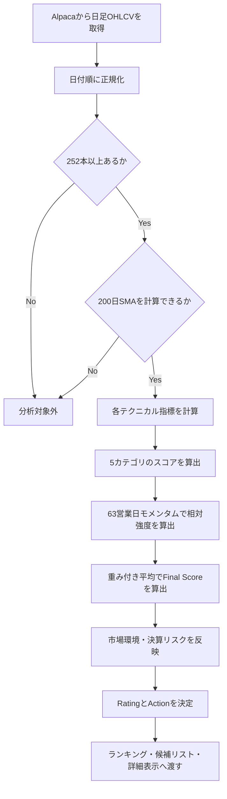
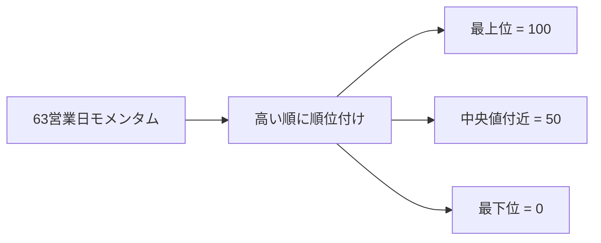

# 半導体銘柄テクニカル分析ロジック

このドキュメントは、主要半導体銘柄を `BUY` / `HOLD` / `SELL` に分類するロジックを説明します。UIでは断定的な表現を避け、`BUY` は「買い検討」、`HOLD` は「監視継続」、`SELL` は「新規買い回避」と表示します。

実装の中心は次のファイルです。

- `lib/semiconductors/analyzer.ts`
- `lib/semiconductors/indicators.ts`
- `lib/semiconductors/types.ts`

## 全体フロー



## データ本数と200日線

200日移動平均線をスコアに使うため、分析に必要な最低日足本数は `252本` です。

252本未満、または200日SMAが計算できない銘柄は、長期トレンドを誤って減点しないため分析対象から除外します。除外銘柄は `summary.excludedSymbols` に入ります。

## 使用指標

| 指標 | 用途 |
| --- | --- |
| 20日SMA | 短期トレンド |
| 50日SMA | 中期トレンド |
| 200日SMA | 長期トレンド |
| 20 / 63 / 126営業日モメンタム | 短期・中期・長期の勢い |
| RSI 14 | 過熱感・弱さの補助確認 |
| MACD 12/26/9 | モメンタムの方向と拡大・縮小 |
| ATR 14 | 値幅リスク |
| 出来高比率 | 直近出来高と20日平均出来高の比較 |
| 直近126営業日高値からの下落率 | 高値からの崩れ具合 |

## カテゴリ別スコア

最終スコアは、個別条件を単純に積み上げる方式ではなく、5つのカテゴリをそれぞれ `0-100` 点に正規化し、重み付き平均で計算します。

```text
finalScore =
  trendScore * 0.30
+ momentumScore * 0.25
+ relativeStrengthScore * 0.20
+ riskScore * 0.15
+ volumeScore * 0.10
```

各銘柄には次の内訳が返ります。

```ts
scoreBreakdown: {
  trendScore: number;
  momentumScore: number;
  relativeStrengthScore: number;
  riskScore: number;
  volumeScore: number;
}
```

## trendScore

トレンドスコアは、終値が20日線・50日線・200日線を上回っているか、50日線が200日線を上回っているかを見ます。さらに、終値と各SMAの乖離率も軽く反映します。

移動平均系の情報は似た意味を持つため、過剰な重複加点にならないよう、トレンドカテゴリ内でまとめて評価します。

## momentumScore

モメンタムスコアは、20 / 63 / 126営業日モメンタムとMACD Histogramで計算します。

20日と63日のモメンタムは相関が高いため、それぞれを独立に大きく加点するのではなく、カテゴリ内で重みを分けています。MACD Histogramは符号だけでなく、前回値より拡大しているかも見ます。

## relativeStrengthScore

分析対象銘柄内で、63営業日モメンタムを順位付けします。最上位を100点、最下位を0点として線形変換します。



このカテゴリにより、単独で強いだけでなく、半導体セクター内で相対的に資金が向かっている銘柄を評価できます。

## riskScore

リスクスコアは、高いほど低リスクです。

主に次を見ます。

- ATR比率: `ATR14 / 終値`
- 直近126営業日高値からの下落率

ATR比率が高い銘柄、または高値から大きく崩れている銘柄は減点されます。閾値は定数化しており、将来的に銘柄別パーセンタイル方式へ移行しやすい形にしています。

## volumeScore

出来高スコアは、当日出来高だけでなく、直近5日平均出来高も見ます。

| 指標 | 計算 |
| --- | --- |
| 当日出来高比率 | `最新出来高 / 20日平均出来高` |
| 5日出来高比率 | `5日平均出来高 / 20日平均出来高` |

出来高増を伴う上昇は加点し、出来高増を伴う下落は減点します。

## Rating と Action

Final Score から Rating を決め、Rating から内部Actionを決めます。

| Final Score | Rating | 内部Action | UI表示 |
| ---: | --- | --- | --- |
| 80以上 | `STRONG_BUY` | `BUY` | 買い検討 |
| 65以上80未満 | `BUY` | `BUY` | 買い検討 |
| 45以上65未満 | `WATCH` | `HOLD` | 監視継続 |
| 30以上45未満 | `SELL` | `SELL` | 新規買い回避 |
| 30未満 | `STRONG_SELL` | `SELL` | 新規買い回避 |

## 損切り目安

損切り目安は、防衛的な損失限定ラインとして計算します。

```text
stopLoss = max(currentPrice - ATR * 2.2, sma50 * 0.96)
```

50日SMAがない場合は `currentPrice - ATR * 2.2` を使います。ATRがない場合は `currentPrice * 0.04` を代替ATRとして使います。

## シグナル遷移

永続化された前回Actionがある場合に備えて、シグナル変化を表す型と純粋関数を用意しています。

```ts
calculateSignalChange(previousAction, currentAction)
```

返り値は次のいずれかです。

- `NEW_BUY`
- `BUY_CONTINUATION`
- `BUY_TO_HOLD`
- `HOLD_TO_BUY`
- `NEW_SELL`
- `SELL_CONTINUATION`
- `SELL_TO_HOLD`
- `NO_CHANGE`

現時点では過去分析結果の永続化は未実装です。将来的にはDBやローカルストレージに前回Actionを保存し、今回結果と比較します。

## 市場環境フィルター

SMHとQQQの日足を同時に取得し、簡易的な市場環境を計算します。

| 条件 | marketRegime |
| --- | --- |
| SMHとQQQがともに50日線より上 | `bullish` |
| どちらかが50日線を下回る | `neutral` |
| 両方が50日線を下回る、またはQQQが200日線を下回る | `defensive` |

`neutral` ではFinal Scoreを軽く減点し、`defensive` ではより強く減点します。これは個別銘柄が強く見えても、指数全体の地合いが悪いと新規エントリーの成功率が下がりやすいためです。

## 決算前フィルター

将来的に決算予定日を取得した場合に備えて、`earningsDate` と `applyEarningsRiskFilter` を用意しています。

仕様は次の通りです。

- 決算予定日が今後5営業日以内の場合、`BUY` を `HOLD` に落とす
- `risks` に「決算前のため新規エントリー注意」を追加する
- `earningsDate` がない場合は何もしない

現時点では決算予定日取得APIは追加していません。

## 解釈のポイント

`BUY` は「買い検討」または「強気監視」であり、即時購入を指示するものではありません。

`SELL` は「新規買い回避」または「弱含み」であり、保有銘柄の即時売却を断定するものではありません。

半導体銘柄は、決算、ガイダンス、AI需要、輸出規制、金利、為替、設備投資サイクルの影響を強く受けます。このロジックは価格と出来高を中心に見るため、ファンダメンタルズやニュースと組み合わせて使う前提です。
