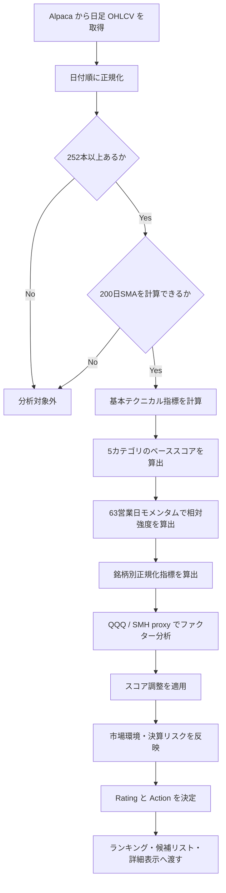
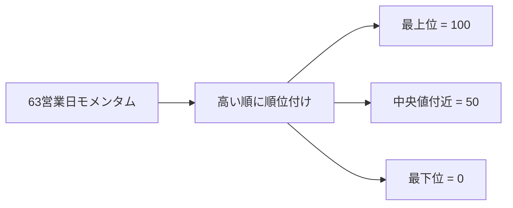

# 半導体銘柄テクニカル分析ロジック

このドキュメントは、主要半導体・AI 関連銘柄を `BUY` / `HOLD` / `SELL` に分類する分析ロジックを説明します。UI では断定的な表現を避け、`BUY` は「買い検討」、`HOLD` は「監視継続」、`SELL` は「新規買い回避」と表示します。

現行ロジックは、従来の価格・出来高テクニカルに加えて、銘柄自身の履歴に対する正規化、QQQ / SMH を proxy にした CAPM 風ファクター分析、バックテスト用の検証基盤を持ちます。

実装の中心は次のファイルです。

- `lib/semiconductors/analyzer.ts`
- `lib/semiconductors/indicators.ts`
- `lib/semiconductors/normalization.ts`
- `lib/semiconductors/factors.ts`
- `lib/semiconductors/backtest.ts`
- `lib/semiconductors/types.ts`

## 全体フロー



## データ本数と200日線

200日移動平均線をスコアに使うため、分析に必要な最低日足本数は `252本` です。

252本未満、または200日SMAが計算できない銘柄は、長期トレンドを誤って減点しないため分析対象から除外します。除外銘柄は `summary.excludedSymbols` に入ります。

## 使用指標

| 指標 | 用途 |
| --- | --- |
| 20日SMA | 短期トレンド |
| 50日SMA | 中期トレンド |
| 200日SMA | 長期トレンド |
| 20 / 63 / 126営業日モメンタム | 短期・中期・長期の勢い |
| RSI 14 | 過熱感・弱さの補助確認 |
| MACD 12/26/9 | モメンタムの方向と拡大・縮小 |
| ATR 14 | 値幅リスク |
| 出来高比率 | 直近出来高と20日平均出来高の比較 |
| 直近126営業日高値からの下落率 | 高値からの崩れ具合 |
| 銘柄別パーセンタイル | 銘柄自身の過去レンジに対する現在位置 |
| 銘柄別 Z スコア | 価格位置の伸びすぎ確認 |
| CAPM 風 β / α | QQQ / SMH への感応度と市場調整後の強さ |
| 残差ボラティリティ | 市場・セクターで説明できない値動きリスク |

## ベーススコア

最初に、5つのカテゴリをそれぞれ `0-100` 点に正規化し、重み付き平均でベーススコアを計算します。

```text
baseScore =
  trendScore * 0.30
+ momentumScore * 0.25
+ relativeStrengthScore * 0.20
+ riskScore * 0.15
+ volumeScore * 0.10
```

各銘柄には次の内訳が返ります。

```ts
scoreBreakdown: {
  trendScore: number;
  momentumScore: number;
  relativeStrengthScore: number;
  riskScore: number;
  volumeScore: number;
}
```

### trendScore

終値が20日線・50日線・200日線を上回っているか、50日線が200日線を上回っているかを見ます。さらに、終値と各SMAの乖離率も軽く反映します。

移動平均系の情報は似た意味を持つため、過剰な重複加点にならないよう、トレンドカテゴリ内でまとめて評価します。

### momentumScore

20 / 63 / 126営業日モメンタムと MACD Histogram で計算します。

20日と63日のモメンタムは相関が高いため、それぞれを独立に大きく加点するのではなく、カテゴリ内で重みを分けています。MACD Histogram は符号だけでなく、前回値より拡大しているかも見ます。

### relativeStrengthScore

分析対象銘柄内で、63営業日モメンタムを順位付けします。最上位を100点、最下位を0点として線形変換します。



このカテゴリにより、単独で強いだけでなく、半導体セクター内で相対的に資金が向かっている銘柄を評価できます。

### riskScore

リスクスコアは、高いほど低リスクです。

主に次を見ます。

- ATR比率: `ATR14 / 終値`
- 直近126営業日高値からの下落率

ATR比率が高い銘柄、または高値から大きく崩れている銘柄は減点されます。

### volumeScore

出来高スコアは、当日出来高だけでなく、直近5日平均出来高も見ます。

| 指標 | 計算 |
| --- | --- |
| 当日出来高比率 | `最新出来高 / 20日平均出来高` |
| 5日出来高比率 | `5日平均出来高 / 20日平均出来高` |

出来高増を伴う上昇は加点し、出来高増を伴う下落は減点します。

## 銘柄別正規化

固定閾値だけでは、NVDA、TSM、ASML、INTC のように通常ボラティリティが異なる銘柄を同じ尺度で評価してしまいます。そのため `normalization.ts` で、各銘柄自身の履歴に対する相対位置を計算します。

主な出力は次の通りです。

```ts
normalizedTechnicals: {
  closePercentileRank: number | null;
  closeZScore: number | null;
  atrPctPercentile: number | null;
  momentum20Percentile: number | null;
  momentum63Percentile: number | null;
  momentum126Percentile: number | null;
}
```

評価の考え方:

- 63日モメンタムが銘柄自身の過去レンジ上位なら小さく加点
- 126日モメンタムが過去レンジ上位なら小さく加点
- ATR が銘柄自身の過去レンジで極端に高い場合は減点
- 価格 Z スコアが高すぎる場合は、短期的な伸びすぎとして減点

これらは `scoreAdjustments` として返ります。

```ts
scoreAdjustments: Array<{
  source: "normalization" | "factor" | "market-regime" | "earnings" | "signal-stability";
  label: string;
  value: number;
}>
```

重要な制約として、正規化・ファクター調整だけで `BUY` 閾値をまたがせないようにしています。ベーススコアが `BUY` 未満の銘柄は、調整後も `BUY` 閾値直下に留めます。これは補助指標だけで新規買い判定が発生することを避けるためです。

## CAPM / ファクター分析

`factors.ts` は、CAPM やマルチファクター分析に使う純粋関数を提供します。

主な関数:

- `calculateReturns`
- `calculateExcessReturns`
- `calculateBetaFromReturns`
- `calculateCapmExposure`
- `calculateMultiFactorExposure`
- `buildFactorScore`

分析本体では、現在は外部ファクターデータを取得せず、取得済みの日足だけを使います。

| Proxy | 用途 |
| --- | --- |
| QQQ | 市場・大型グロース proxy |
| SMH | 半導体セクター proxy |

`analyzer.ts` では、銘柄リターンを QQQ / SMH のリターンと日付で突き合わせ、β、年率換算 α、残差ボラティリティ、factorScore を計算します。

```ts
factorAnalysis: {
  marketBeta: number | null;
  sectorBeta: number | null;
  alpha: number | null;
  residualVolatility: number | null;
  factorScore: number | null;
  observations: number;
}
```

factorScore が高い場合は、市場・セクターを考慮しても強い銘柄として小さく加点します。factorScore が低い場合、または高βかつ残差ボラティリティが高い場合は小さく減点します。

このファクター分析は、本格的な Fama-French や APT の代替ではありません。現時点では、テクニカル判定に「市場・セクター要因で説明できる強さか、銘柄固有の強さか」を補助的に加えるための軽量な proxy です。

## Rating と Action

調整後の Final Score から Rating を決め、Rating から内部 Action を決めます。

| Final Score | Rating | 内部Action | UI表示 |
| ---: | --- | --- | --- |
| 80以上 | `STRONG_BUY` | `BUY` | 買い検討 |
| 65以上80未満 | `BUY` | `BUY` | 買い検討 |
| 45以上65未満 | `WATCH` | `HOLD` | 監視継続 |
| 30以上45未満 | `SELL` | `SELL` | 新規買い回避 |
| 30未満 | `STRONG_SELL` | `SELL` | 新規買い回避 |

## 市場環境フィルター

SMH と QQQ の日足を同時に取得し、簡易的な市場環境を計算します。

| 条件 | marketRegime |
| --- | --- |
| SMH と QQQ がともに50日線より上 | `bullish` |
| どちらかが50日線を下回る | `neutral` |
| 両方が50日線を下回る、または QQQ が200日線を下回る | `defensive` |

`defensive` では Final Score を減点し、`scoreAdjustments` に市場環境由来の調整として残します。`neutral` は現行実装では減点しません。

## 損切り・利確目安

損切り目安は、防衛的な損失限定ラインとして計算します。

```text
stopLoss = max(currentPrice - ATR * 2.2, sma50 * 0.96)
```

50日SMAがない場合は `currentPrice - ATR * 2.2` を使います。ATRがない場合は `currentPrice * 0.04` を代替ATRとして使います。

利確目安は現在値から ATR 3本分を上に置きます。

```text
takeProfit = currentPrice + ATR * 3
```

## シグナル遷移

永続化された前回 Action がある場合に備えて、シグナル変化を表す型と純粋関数を用意しています。

```ts
calculateSignalChange(previousAction, currentAction)
```

返り値は次のいずれかです。

- `NEW_BUY`
- `BUY_CONTINUATION`
- `BUY_TO_HOLD`
- `HOLD_TO_BUY`
- `NEW_SELL`
- `SELL_CONTINUATION`
- `SELL_TO_HOLD`
- `NO_CHANGE`

## 自動売買向けの意図分類

分析結果の `BUY` / `HOLD` / `SELL` は、直接の発注命令ではありません。自動売買では `trading/intent.ts` が、分析結果、保有状況、設定、未約定注文をもとに `TradeIntentCandidate` を作ります。

主な意図:

- `OPEN_LONG`: 未保有銘柄の新規買い候補
- `ADD_LONG`: 保有中銘柄の追加買い候補
- `REDUCE_LONG`: 一部削減候補
- `CLOSE_LONG`: 全撤退候補
- `NO_ACTION`: 発注なし

追加メタデータ:

- `stance`: `bullish` / `neutral` / `bearish`
- `actionReason`: `BUY_SIGNAL`、`SELL_AVOID_NEW_BUY`、`WEAK_SELL_REDUCE` など
- `exitReason`: `STOP_LOSS`、`SEVERE_SELL_SIGNAL` など
- `scoreGate`: エントリースコア条件を通過したか
- `entryScoreThreshold`
- `severeSellExitScoreThreshold`

現行の既定値では、通常の弱い `SELL` は保有銘柄の `REDUCE_LONG`、損切り到達または `severeSellExitScoreThreshold` 以下の強い悪化は `CLOSE_LONG` になります。未保有銘柄の `SELL` は「新規買い回避」であり、売り注文にはなりません。

## バックテスト

`backtest.ts` は、分析ロジックの客観検証用に `runSignalBacktest()` を提供します。

```ts
runSignalBacktest(barsBySymbol, universe?, options?)
```

特徴:

- ネットワーク呼び出しなしの純粋 TypeScript
- 過去の各 as-of 時点で `analyzeSemiconductors()` を実行
- 既定では 20 / 63 営業日先を検証
- Action 別、スコア帯別、Action + スコア帯別に集計
- 将来データ不足の horizon はスキップし、件数を記録

主な集計値:

- `count`
- `wins`
- `winRate`
- `averageReturn`
- `averageMaxDrawdown`
- `averageAdverseExcursion`
- `bestReturn`
- `worstReturn`

このバックテストは、スコアの閾値や重みを変更したときに、翌20営業日・63営業日の成績が改善したかを確認するための基盤です。

## 決算前フィルター

`earningsDate` がある場合、決算予定日が今後5営業日以内なら `BUY` を `HOLD` に落とし、`risks` に「決算前のため新規エントリー注意」を追加します。

現時点では決算予定日取得 API は追加していません。`SymbolProfile.earningsDate` に値が入っている場合だけ働きます。

## 解釈のポイント

`BUY` は「買い検討」または「強気監視」であり、即時購入を指示するものではありません。

`SELL` は「新規買い回避」または「弱含み」であり、未保有銘柄の空売りや、保有銘柄の即時全売却を自動的に意味しません。保有銘柄の売却可否は `trading/intent.ts` の意図分類とリスク設定で判断します。

半導体銘柄は、決算、ガイダンス、AI需要、輸出規制、金利、為替、設備投資サイクルの影響を強く受けます。このロジックは価格・出来高・市場 proxy を中心に見るため、ファンダメンタルズやニュースと組み合わせて使う前提です。
