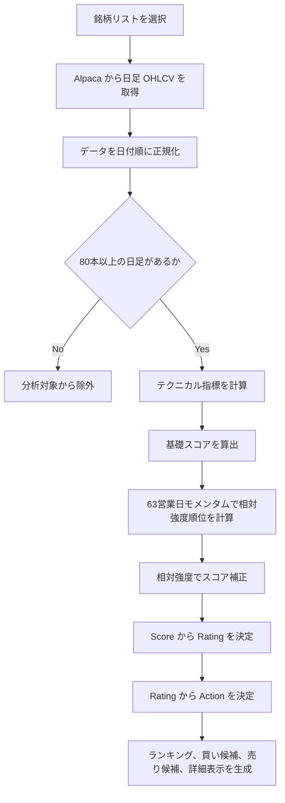
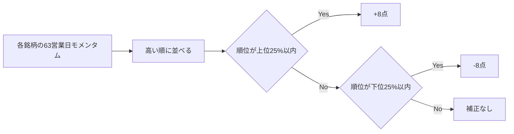

# 半導体銘柄テクニカル分析ロジック

このドキュメントは、アプリ内で主要半導体銘柄の「買い時」「様子見」「売り時」を判定するためのロジックを説明します。実装の中心は `lib/semiconductors/analyzer.ts` と `lib/semiconductors/indicators.ts` です。

## 目的

この分析は、半導体関連銘柄を同じ基準で横断比較し、短期から長期までのトレンド、モメンタム、出来高、ボラティリティ、セクター内の相対強度をスコア化します。

最終的には各銘柄に対して次の3分類を返します。

| Action | 意味 |
| --- | --- |
| `BUY` | 買い候補。トレンド、モメンタム、相対強度がそろっている状態 |
| `HOLD` | 様子見。明確な買い・売りの優位性が足りない状態 |
| `SELL` | 売り候補、または新規買い回避。トレンドや勢いが弱い状態 |

注意: この判定は投資助言ではなく、売買判断を補助するためのテクニカル分析です。決算、ニュース、需給、流動性、ポジションサイズは別途確認してください。

## 分析対象

デフォルトでは次の主要半導体銘柄を分析します。

| Symbol | Name | Segment |
| --- | --- | --- |
| `NVDA` | NVIDIA | AI GPU / Data Center |
| `AMD` | Advanced Micro Devices | CPU / GPU |
| `AVGO` | Broadcom | Networking / ASIC |
| `TSM` | Taiwan Semiconductor | Foundry |
| `ASML` | ASML | Lithography |
| `QCOM` | Qualcomm | Mobile / Edge AI |
| `INTC` | Intel | CPU / Foundry |
| `TXN` | Texas Instruments | Analog |
| `MU` | Micron | Memory |
| `AMAT` | Applied Materials | Equipment |
| `LRCX` | Lam Research | Equipment |
| `KLAC` | KLA | Process Control |
| `MRVL` | Marvell | Data Infrastructure |
| `ARM` | Arm Holdings | IP / Architecture |

## 全体フロー



## 入力データ

Alpaca から取得する日足データは次の形式です。

| 項目 | 内容 |
| --- | --- |
| `date` | 日付 |
| `open` | 始値 |
| `high` | 高値 |
| `low` | 安値 |
| `close` | 終値 |
| `volume` | 出来高 |

アプリでは `adjustment=all` を指定して、株式分割などを調整した価格を使います。分析に必要な最低本数は80本です。80本未満の銘柄は、指標の信頼性が不足するため除外します。

## 使用するテクニカル指標

### 移動平均線

| 指標 | 用途 |
| --- | --- |
| 20日単純移動平均線 | 短期トレンド確認 |
| 50日単純移動平均線 | 中期トレンド確認 |
| 200日単純移動平均線 | 長期トレンド確認 |

基本的には、終値が移動平均線を上回るほど強く、下回るほど弱いと判断します。また、50日線が200日線を上回っている場合は、トレンド構造が良いと判断します。

### モメンタム

指定期間前の終値と現在の終値を比較します。

```text
momentum = 現在の終値 / N営業日前の終値 - 1
```

| 指標 | 用途 |
| --- | --- |
| 20営業日モメンタム | 約1か月の短期勢い |
| 63営業日モメンタム | 約3か月の中期勢い、相対強度ランキングにも使用 |
| 126営業日モメンタム | 約6か月の参考値 |

### RSI

RSI は14日で計算します。アプリでは、強すぎず弱すぎない `50から68` を買いやすいゾーンとして扱います。

| RSI | 解釈 |
| --- | --- |
| 50以上68以下 | 上昇の勢いがあり、過熱しすぎていない |
| 78超 | 短期過熱に注意 |
| 38未満 | 弱く、反発確認待ち |

### MACD

MACD は標準的な `12 / 26 / 9` を使います。

| 項目 | 内容 |
| --- | --- |
| Fast EMA | 12日指数移動平均 |
| Slow EMA | 26日指数移動平均 |
| Signal | MACD の9日指数移動平均 |
| Histogram | MACD - Signal |

Histogram がプラスなら買い圧力が優勢、マイナスなら勢い不足と判断します。

### ボリンジャーバンド

20日移動平均と標準偏差2本で上下バンドを計算します。現時点では表示・詳細分析用の指標として保持しており、スコアには直接加点・減点していません。

### ATR

ATR は14日で計算します。現在価格に対するATR比率を `atrPct` として使います。

```text
atrPct = ATR14 / 現在の終値
```

`atrPct` が `7.5%` を超える場合は、値幅リスクが大きいとして減点します。

### 出来高比率

直近出来高を20日平均出来高で割ります。

```text
volumeRatio = 最新出来高 / 20日平均出来高
```

`volumeRatio > 1.35` のとき、出来高が増えていると判断します。出来高増を伴う上昇は加点、出来高増を伴う下落は減点します。

### 直近高値からの下落率

直近126営業日の高値から、現在価格がどれだけ下落しているかを見ます。

```text
drawdownFromHigh = 現在の終値 / 直近126営業日の高値 - 1
```

`-22%` より深く下落している場合は、トレンド悪化リスクとして減点します。

## スコアリング

各銘柄はまず `50点` からスタートします。指標ごとに加点・減点し、最後に `0から100` に丸めます。

### トレンド評価

| 条件 | 点数 | 理由 |
| --- | ---: | --- |
| 終値 > 20日線 | +6 | 短期トレンドが上向き |
| 終値 <= 20日線 | -6 | 短期の上値が重い |
| 終値 > 50日線 | +9 | 中期トレンドが維持されている |
| 終値 <= 50日線 | -10 | 下降継続の可能性 |
| 終値 > 200日線 | +12 | 長期上昇トレンド |
| 終値 <= 200日線 | -18 | 長期トレンドが弱い |
| 50日線 > 200日線 | +6 | トレンド構造が良い |

### モメンタム評価

| 条件 | 点数 | 理由 |
| --- | ---: | --- |
| 20営業日モメンタム > 8% | +8 | 短期モメンタムが強い |
| 20営業日モメンタム < -5% | -8 | 短期モメンタムが悪化 |
| 63営業日モメンタム > 18% | +11 | 3か月モメンタムが強い |
| 63営業日モメンタム > 6% | +6 | 3か月モメンタムがプラス |
| 63営業日モメンタム < -8% | -10 | 3か月モメンタムがマイナス |

### RSI 評価

| 条件 | 点数 | 理由 |
| --- | ---: | --- |
| RSI 50以上68以下 | +8 | 買いやすい強さ |
| RSI 78超 | -7 | 短期過熱 |
| RSI 38未満 | -8 | 弱く、反発確認待ち |

### MACD 評価

| 条件 | 点数 | 理由 |
| --- | ---: | --- |
| MACD Histogram > 0 | +7 | 買い圧力が優勢 |
| MACD Histogram <= 0 | -6 | 勢いが不足 |

### 出来高評価

| 条件 | 点数 | 理由 |
| --- | ---: | --- |
| 出来高比率 > 1.35 かつ当日上昇 | +5 | 出来高増を伴う上昇 |
| 出来高比率 > 1.35 かつ当日下落 | -5 | 出来高増を伴う下落 |

### リスク評価

| 条件 | 点数 | 理由 |
| --- | ---: | --- |
| ATR比率 > 7.5% | -5 | 値幅リスクが大きい |
| 直近126営業日高値から22%超下落 | -7 | 高値からの下落が深い |

## 相対強度による補正

基礎スコアを出したあと、分析対象銘柄内で `63営業日モメンタム` を比較します。これは、半導体セクター内でどの銘柄が相対的に強いかを見るためです。



| 条件 | 補正 |
| --- | ---: |
| 相対強度順位が上位25%以内 | +8 |
| 相対強度順位が下位25%以内 | -8 |
| それ以外 | 0 |

## Rating と Action の決定

最終スコアから `Rating` を決め、その `Rating` を `Action` に変換します。

| Score | Rating | Action |
| ---: | --- | --- |
| 82以上 | `STRONG_BUY` | `BUY` |
| 66以上82未満 | `BUY` | `BUY` |
| 44以上66未満 | `WATCH` | `HOLD` |
| 28以上44未満 | `SELL` | `SELL` |
| 28未満 | `STRONG_SELL` | `SELL` |

アプリ上では、`BUY` は「買い時」、`HOLD` は「様子見」、`SELL` は「売り時」と表示します。

## 買値・損切り・利確目安

銘柄詳細では、スコアとは別に目安価格を表示します。これは注文を自動生成するものではなく、エントリー検討用の参考値です。

| 項目 | 計算方法 | 意味 |
| --- | --- | --- |
| 理想買値 | `min(現在価格, trendReference + ATR * 0.35)` | 現在価格から大きく追いすぎない買い目安 |
| 押し目 | `20日線`、なければ `現在価格 - ATR` | 短期移動平均付近の押し目目安 |
| 損切り目安 | `min(現在価格 - ATR * 2.2, 50日線 * 0.96)` | 値幅と中期線を考慮した防衛ライン |
| 利確目安 | `現在価格 + ATR * 3` | ATRベースの上値目安 |

`trendReference` は、20日線、50日線、`現在価格 - ATR` のうち最も高い値を使います。ATRが取得できない場合は、現在価格の4%を代替値として使います。

## マーケットバイアス

個別銘柄の判定に加えて、全体の地合いも返します。

| 条件 | Bias | 表示 |
| --- | --- | --- |
| BUY 銘柄が全体の40%以上 | `bullish` | 強気 |
| SELL 銘柄が全体の40%以上 | `defensive` | 守り |
| それ以外 | `neutral` | 中立 |

## 出力される主な情報

分析結果では、次の情報を UI に渡します。

| 項目 | 内容 |
| --- | --- |
| `recommendations` | 全銘柄をスコア順に並べた一覧 |
| `buyCandidates` | `Action = BUY` の銘柄 |
| `sellCandidates` | `Action = SELL` の銘柄 |
| `watchlist` | `Action = HOLD` の銘柄 |
| `summary.averageScore` | 分析対象全体の平均スコア |
| `summary.marketBias` | 全体地合い |
| `reasons` | 買い材料として表示する説明 |
| `risks` | 注意点として表示する説明 |
| `buyZone` | 理想買値、押し目、損切り、利確目安 |
| `chart` | 直近90本の終値、20日線、50日線 |

## 解釈のポイント

`BUY` は「今すぐ全資金で買う」という意味ではありません。トレンドとモメンタムがそろっており、監視優先度が高いという意味です。

`SELL` は、保有している場合の利確・損切り検討、または新規買いを避ける候補です。特に長期線割れ、モメンタム悪化、相対強度下位が重なる銘柄は慎重に扱います。

半導体銘柄は決算、ガイダンス、輸出規制、AI需要、金利、為替、設備投資サイクルの影響を強く受けます。このロジックは価格と出来高だけを見るため、ファンダメンタルズやニュースと組み合わせて使う前提です。
